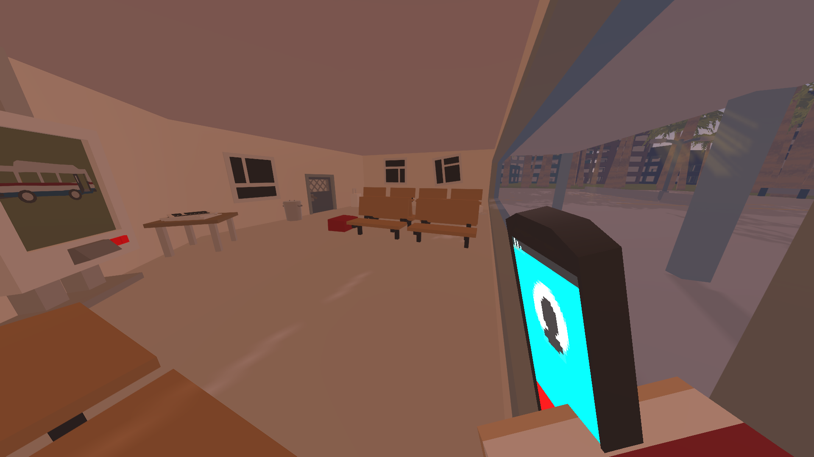
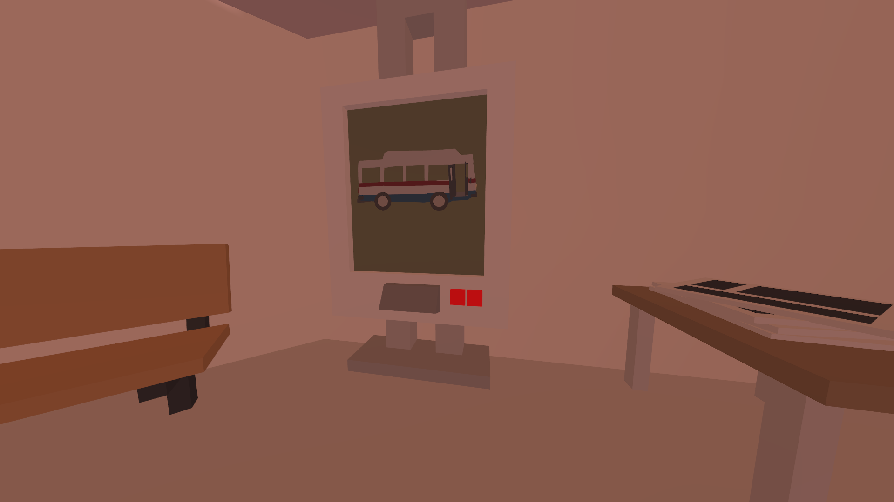
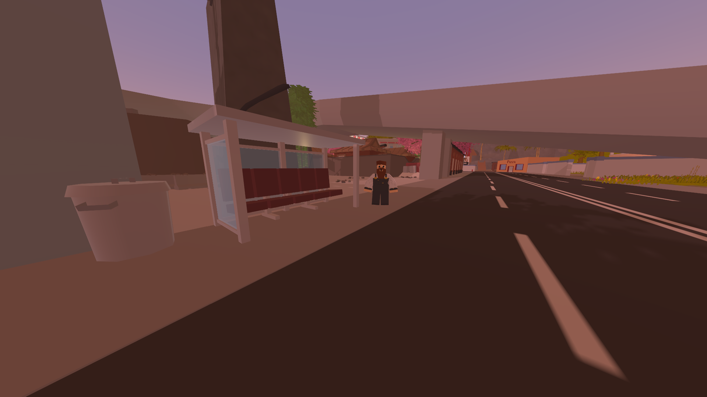
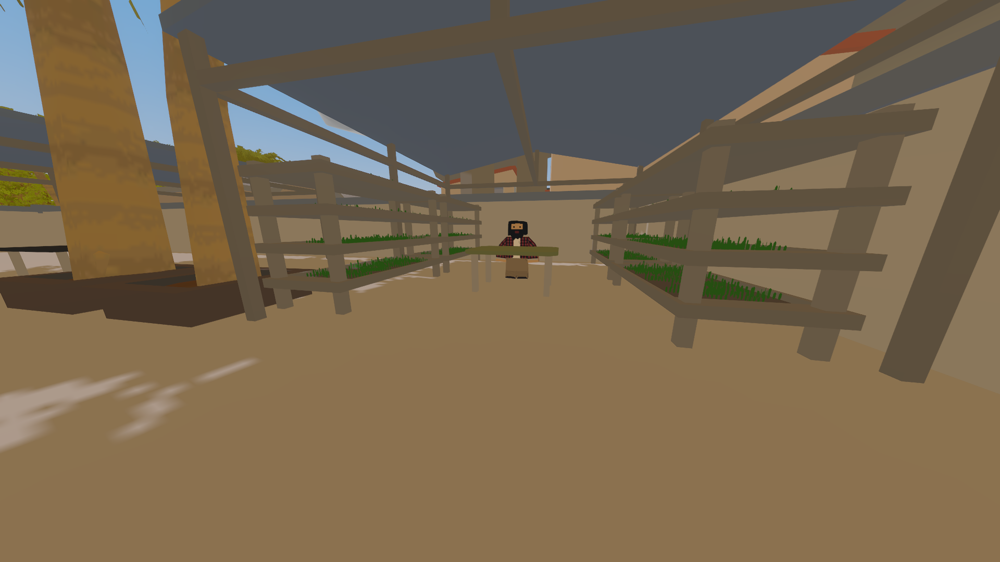
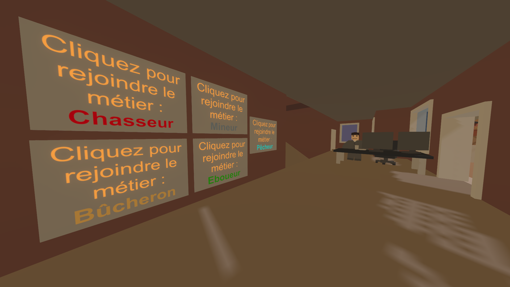

# Combien bien débuter sur le serveur ?

## Le spawn :

Vous venez d'arriver à Lakoya, vous êtes en salle de débarquement, et attendait votre bateau pour rejoindre l'île.

Si vous êtes Whitelist, cliquez sur le bouton plus bas, sinon, vous êtes en attente de Visa, faites une candidature pour le valider.

Cliquez sur un des deux gros boutons rouges. Un message s'affiche, vous montez dans le bateau, votre aventure commence, à vous de la définir...

## Astria

Vous arrivez ensuite à Astria

Parlez au NPC, il vous donnera des infos intéressantes

Maintenant, dirigez-vous vers la place de marché d'Astria qui est juste à côté de vous. Parlez au NPC Hubert, il vous donnera toutes les infos pour ramasser des olives.


#### Il est conseillé de s'acheter une carte bancaire pour sécuriser votre compte \(voir Explication du fonctionnement de l'argent\)



#### Achetez vous des vêtements pour ne pas être arrêté par la police


## J'ai suffisamment farm d'olive...

Rendez-vous à la mairie d'Astria pour choisir un vrai métier. Frappez un panneau, et désormais, vous incarnez ce métier. Attention, vous ne pouvez changer de métier que toutes les deux heures.

