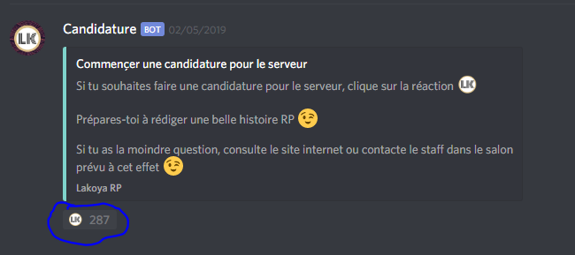

# Comment faire une candidature ?

## Rejoindre le Discord

Avant de faire une candidature, il est intéressant de rejoindre le Discord. C'est mieux, non ?

http://discord.lakoya-rp.fr


 Pensez à accepter le règlement pour avoir accès aux différents salons


### Commencer une candidature

Allez dans le salon 📚𝗥𝗘𝗚𝗟𝗘𝗠𝗘𝗡𝗧 , et cliquez sur la réaction Lakoya

### Le bot

Désormais, le bot va vous posez une dizaine de questions, lorsque vous aurez fini, il récapitulera votre candidature, et vous proposera de l'envoyer ou de la recommencer


L'histoire RP demande plus de 100 mots, rédigez la à l'avance pour ne pas faire de fautes, et être correct dans sa syntaxe.



Si le bot vous indique qu'il n'y a pas suffisament de mot, ne comblez pas avec des mots sans aucun sens. Sinon, la candidature est automatiquement refusé


### L'approbation

Maintenant, votre candidature va être analysée par le staff. Le délai peut durer jusqu'à 48 heures \(c'est souvent moins\). Ne soyez donc pas pressé.

### Si la candidature est refusée 😪

Vous avez le droit de refaire votre candidature. Vous devez prendre compte des remarques qui vous ont été faites.



