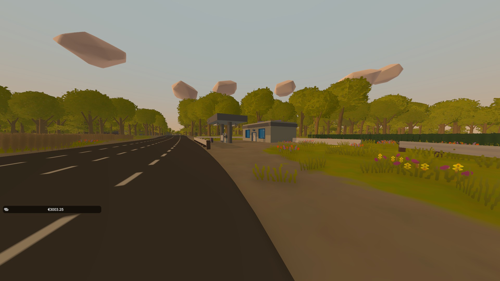
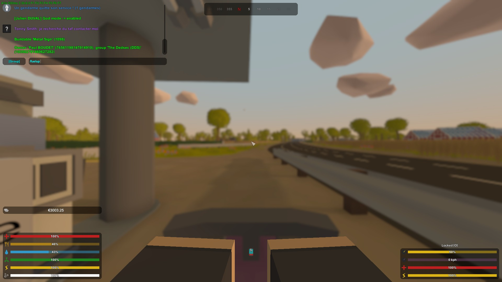

# Comment rajouter de l'essence à son véhicule ?

## Station essence 🛢️

Avant de mettre de l'essence, localisez une station essence qui vous permettra de vous ravitailler 

## /fuelup 😮

Une fois arrivé à la station essence, ne descendez pas de votre véhicule \(laissez le pompiste faire son travail, il s'ennuie suffisament comme ça 😃 \)

Ensuite, tapez la commande `/fuelup` dans le chat et votre véhicule vient de faire un plein.

Si vous n'avez pas assez d'argent, rajoutez à la fin `/fuelup` la valeur que vous souhaitez mettre

Par exemple : `/fuelup 50` pour remettre 50€ d'essence


Il faut être à une station essence pour que la commande marche !


