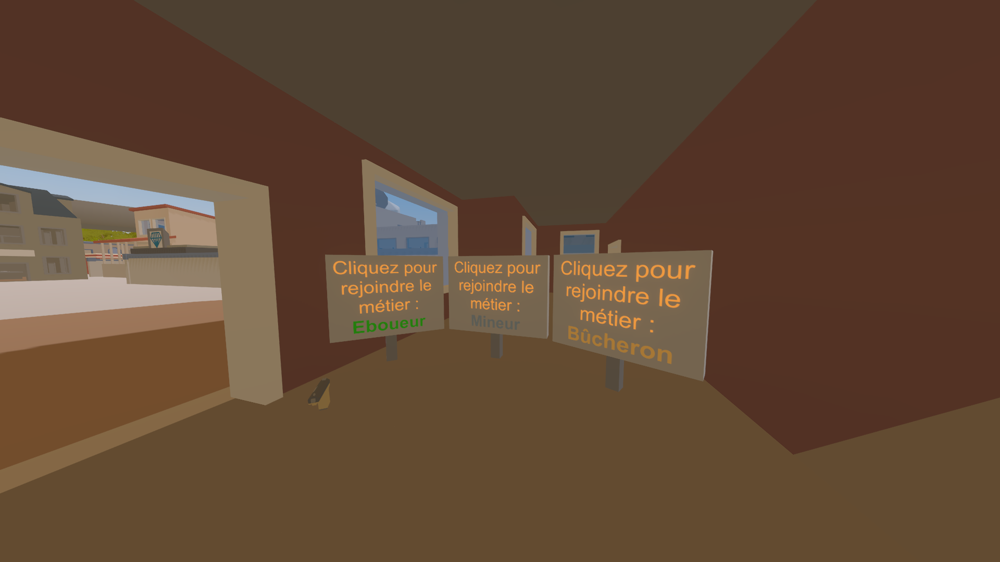

# Comment rejoindre un métier ?

### Panneaux :

Désormais sur Lakoya, vous ne pouvez pratiquer qu'un seul métier à la fois. Cela permet d'éviter les abus de farm, et permettre une régularité.

Alors que certains sont des métiers Whitelist qui ne peuvent être rejoints seulement si vous avez fait une candidature pour les intégrer.

D'autres peuvent être rejoints simplement en frappant un panneau. En effet, il existe à la mairie des panneaux frappables permettant de changer de métiers simplement. Cependant, il existe un cooldown qui permet d'éviter de changer de métier trop souvent.

### ⚠️ Attention :

Si vous essayez de contourner le système en évitant le système de métiers, c'est à vos risques et périles. Bien sûr, ce n'est pas puni par le staff, mais vous pouvez subir une punition in-game. En cas de manquement à ces règles, la police sera automatiquement prévenue, et risque d'intervenir pour vous arrêter. Faites attention !

