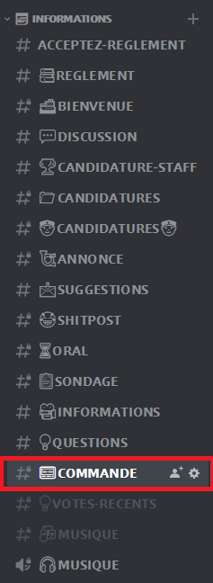
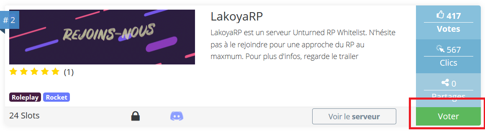

# Comment voter pour le serveur ? 😲


Pour le moment, voter n'apporte aucun avantage. Mais actuellement, des réfléxions ont lieu afin de trouver des récompenses aux joueurs qui votent le plus.


### Introduction 😃

Le bot LakoyaRP permet de créer un leaderboard des utilisateurs qui votent.

Cette magnifique fonctionnalité permet de recenser les joueurs qui votent, ainsi que de leur offrir des récompenses. Pour le moment, nous sommes les seuls en France à avoir cette fonctionnalité entièrement automatisée

Cependant, il faut un minimum de commande à taper afin d'être enregistré dans la base de données.

### Discord 🤖

1\) Allez dans le salon \#📟𝗖𝗢𝗠𝗠𝗔𝗡𝗗𝗘 afin de pouvoir taper les commandes du bot



2\) Faites la commande :

```text
<vote link pseudo
```

\(Remplacez le pseudo par le votre \)


Choisissez un pseudo facilement remémorable et écrivable


### 

### Le site 👩🏻‍💻

Ensuite, allez sur le site du Top Serveur

[Lien du top serveur](https://unturned.top-serveurs.net/)

Cherchez et LakoyaRP, puis cliquez sur voter



Entrez votre pseudo choisi au préalable sur le Discord, indiquez que vous n'êtes pas un robot, puis votez.


> Merci d'avoir suivi ce tutoriel sur comment voter ?

