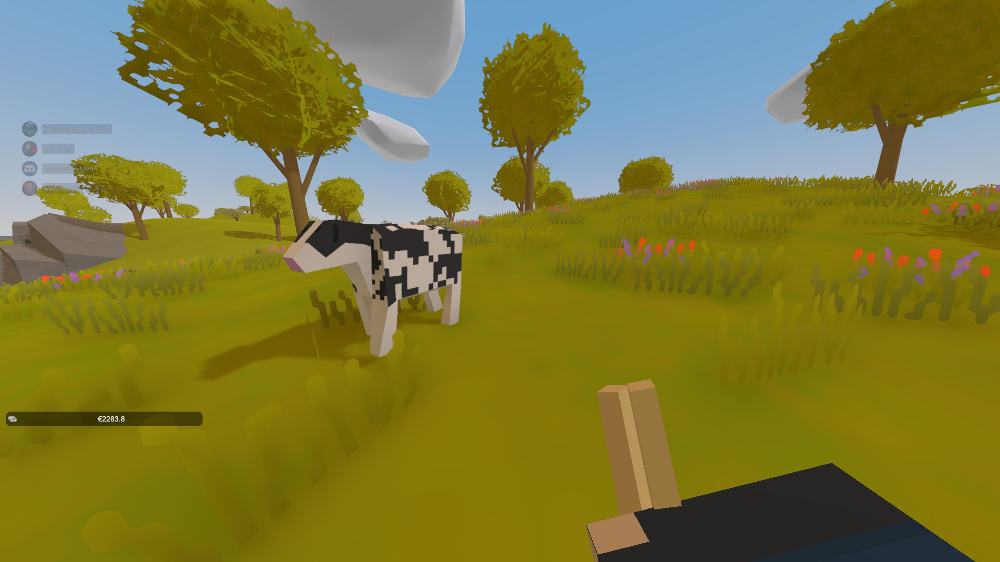
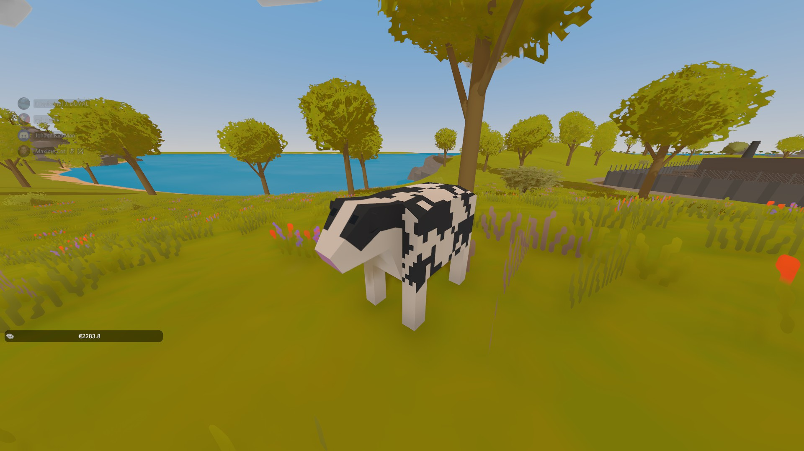

# Reproduction d'animaux

Vous l'aviez demandé, il est enfin arrivé. Vous pouvez dès maintenant faire des élevages d'animaux sur le serveur 😍

## Comment faire ? 😲

### Il y a deux fonctionnalités :

#### La première est la capture d'animaux :

Prenez en main la nourriture spécifique à l'animal, et il vous suivra. Vous pouvez donc l'enfermer quelque part pour le capturer

#### La seconde, reproduction :

Dropez par terre la nourriture, et l'animal le mangera. Ensuite, il y a une chance sur 20 que ça aboutisse à la création d'un nouvel animal. Si ça n'a pas marché, vous devez attendre 5 mins avant de recommencer.

 

## ⚠️ Attention


Il existe des correspondances entre les animaux \(voir plus bas\)


Correspondance :

* Une vache mange et est attirée par du Blé \(Wheat
* Un mouton mange et est attiré du maîs
* Un poulet mange et est attiré par du pain \(bread\)
* Un cochon mange et est attiré par une carrotte \(carrot\)

## Achat d'animaux 💰


Pour le moment, l'achat d'animaux s'étend uniquement aux vaches, mais sera étoffé au fur et à mesure du temps


## Métier de chasseur 🔫

Afin de ne pas tuer le métier de chasseur, les spawns vont être augmentés, et certains animaux \(tel que le dindon\) seront reservés à la chasse.

## Restart du serveur

Tous les joueurs ayant perdus des vaches à cause d'un restart du serveur seront remboursés.

