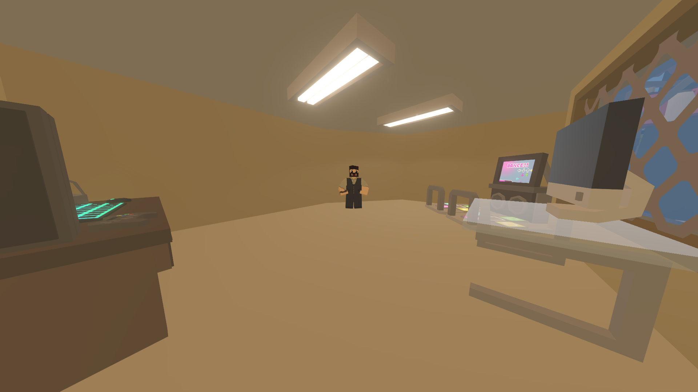

# Où acheter un téléphone

## Astria 🏙️

Le NPC se situe à Astria après le concessionnaire. C'est un petit bâtiment, mais il a une très grande hauteur sous plafond. Il possède une architecture basée sur les Apple Stores.

Voici le batiment en plein Astria. Facilement identifiable, vous pourrez lui acheter téléphone, écouteurs, etc.

## Le vendeur 💸

Voici le vendeur, vous pouvez lui parler, il ne mord pas 🐕

